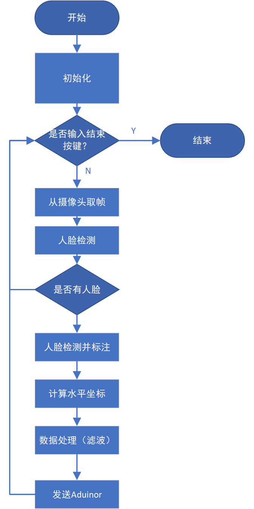

# Single-Axis-Face-Tracking-Camera

基于arduino控制舵机和openCV识别人脸的单轴人脸跟踪相机。

【嵌入式控制题】实现一个单轴人脸跟踪装置。相机朝向可自动切换至面向人脸。

## 解题思路

1. **人脸检测**：首先，需要使用机器视觉技术来进行实时的人脸检测。我选择的是目前比较成熟且容易上手的Viola Jones算法，通常也叫做Haar级联算法。通过调用opencv开源的函数实现。
2. **相机控制**：采用嵌入式控制技术，利用Audinor开发板和SD-90伺服舵机来实现相机方向的控制。通过连接Audinor开发板和SD-90伺服舵机，实现对相机的水平方向转动。
3. **控制舵机**：根据人脸在图像中的位置偏移量，采用单位负反馈控制相机转动的角度，并通过Audinor开发板向SD-90伺服舵机发送相应的控制信号，使其转动到正确的角度。
4. **安全性和稳定性**：对于跟踪装置的实际应用，需要考虑安全性和稳定性。确保相机转动的速度和角度在安全范围内，并避免不必要的震动或抖动。
5. **测试和优化**：在完成装置的搭建后，进行全面的测试和优化。这可能包括调整控制算法参数、改进人脸检测的准确性和鲁棒性，以及验证跟踪装置在不同场景下的性能。

## 算法和硬件方案

- 算法部分

人脸检测部分流程图如下：

有关人脸检测的部分的代码在文件[face_detecting.py](./face_detecting.py)中。

有关arduino控制舵机的代码在文件[arduino_codes.ino](.\arduino_codes\arduino_codes.ino)中。

- 硬件部分

因预算有限，购买的硬件均已能够实现基本功能为标准。使用到的硬件有：

1. Arduino Nano微型控制器
2. SG-90伺服舵机
3. USB摄像头
4. 跳线
5. 面包板
6. 热熔胶枪

## 关键问题

python 与arduino之间的串口通信。一开始控制器在arduino上，经常出现bug。后来将控制器改到了pyhton程序中，arduino只负责执行，结果变好了许多。

## 最后结果

成果在视频[结果展示.mp4](.\结果展示.mp4)中展示出来，所构建的系统能够实现基本的单自由度人脸跟踪功能。

## 创新点

1. face_cascade.detectMultiScale（）函数可以检测图像中所有出现的人脸，而本嵌入式开发的背景是跟踪单个人脸，所以我们选择图像中出现最大的人脸进行跟踪，这样提高了跟踪的精确性和准确性。

## 总结

本次作业旨在实现一个单轴人脸跟踪装置，使相机能够自动切换至面向人脸的方向。为了完成这一目标，我们采用了嵌入式控制技术，利用Audinor开发板和SD-90伺服舵机来控制相机的水平方向转动。通过综合运用机器视觉、嵌入式开发和控制理论等知识，完成了该项目。

虽然我们的摄像头能成功的跟踪人脸，但由于时间有限，该项目还有许多可以优化的地方。可以优化的点有：

1. 对采集到的人脸中心坐标的信号滤波，如卡尔曼滤波、均值漂移、相关滤波等来实现人脸的持续跟踪；
2. 对相机转向角度使用表现性更好的控制器，如PID控制、模糊控制或其他反馈控制算法，以实现平稳准确的转动；
3. 通过更换更好的硬件和更快的处理器来提升系统性能；
4. 使用自己的数据库来训练人脸识别模型，达到对目标范围人脸（某个特定的人或某个人种）更好的识别效果。

## 参考资料

1. P. Viola and M. Jones, "Rapid object detection using a boosted cascade of simple features," Proceedings of the 2001 IEEE Computer Society Conference on Computer Vision and Pattern Recognition. CVPR 2001, Kauai, HI, USA, 2001, pp. I-I, doi: 10.1109/CVPR.2001.990517.
2. https://www.instructables.com/Real-Time-Face-Tracking-Robot-With-Arduino-and-Mat/